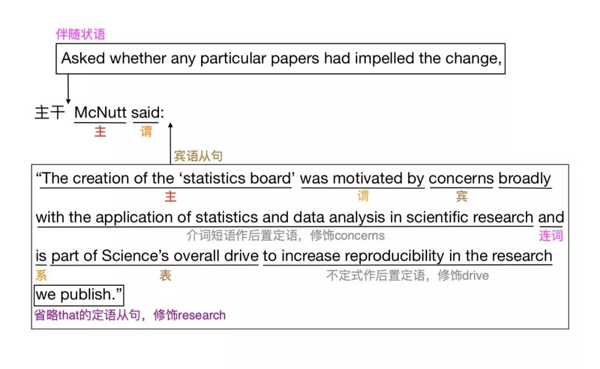
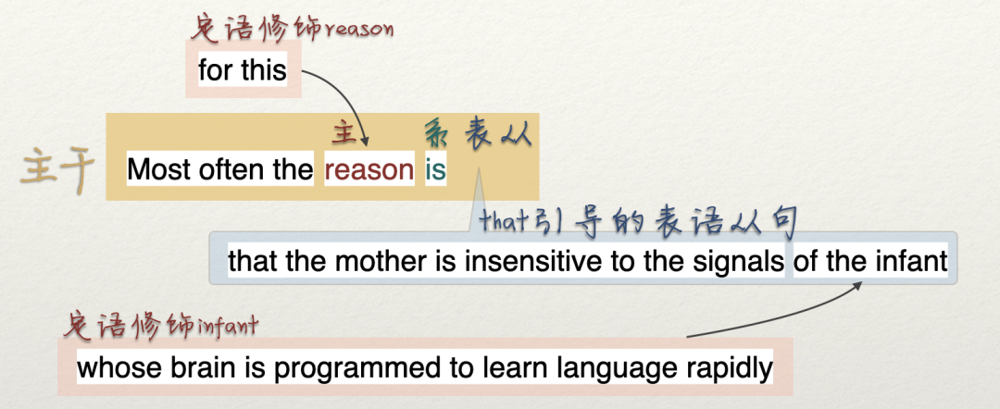

# Sentence

  

    There is only one easy way of stemming this tide of unacceptable filth: forcing the sender’s identity to be made public. If their mum, partner or employer—and the police—knew what they are posting, plenty of keyboard warriors would soon change their tone.
    Questions：According to the author, a quick fix to filth-filled social media is__.

    A.algorithm that eliminates hate speech
    B.stricter regulation by internet giants
    C.revealing identity of senders to the public
    D.forbid the posting of unpleasant words

  

- stem /stem/ 封堵，堵住
- filth /fɪlθ/ 肮脏，龌龊
- keyboard warriors /ˈwɒrɪəz/ 键盘侠
- tone /təʊn/ 语气

Lack of space forbids further treatment of the topic here.
由于篇幅所限，这里不能深入阐述这个问题。

参考译文：制止这种不可接受的污秽潮流只有一个简单的方法：迫使消息的发送者公开自己的身份。

参考译文：一旦键盘侠们的妈妈、伴侣或雇主——和警察——知道他们正在发布的内容，他们中的很多人很快就会改变自己的语气。

根据作者的观点，快速解决充斥着污秽的社交媒体是
A. （消除仇恨言论的算法）A 选项没有提及。
B. （来自互联网巨头的更严格的监管）B 选项没有提及
C. （向其他用户透露发言者的身份）对应第一句！
D. （禁止发表令人不快的言论）D 选项错误。

[原文](https://mp.weixin.qq.com/s/ZEithbnpXDFHJUkQUGGPtA)

  

    Asked whether any particular papers had impelled the change, McNutt said: “The creation of the ‘statistics board’ was motivated by concerns broadly with the application of statistics and data analysis in scientific research and is part of Science’s overall drive to increase reproducibility in the research we publish.”
  

  
- impel/ imˈpel / v.促使；驱策；迫使
- board / bɔ:d / n.(公司或其他机构的)董事会，委员会，理事会
- motivate / ˈməutiveit / v.成为…的动机；是…的原因；激励
- drive / draiv / n.驱动；推动；迫使
- reproducibility / riprə,dju:sə'biliti / n.再现性；再生性

Asked whether any particular papers had impelled the change, 是过去分词作状语的结构，省略了连词和主谓，原句应该是“When McNutt was asked whether any particular papers had impelled the change”。

翻译： 当被问及是否因为某些特定的论文而促成了这次改变，麦克纳特说：“‘统计委员会’的创建是受对科学研究中统计和数据分析应用的广泛关切的驱动，也是《科学》为提升其发表研究的可复制性的全面努力的一部分。”

  

    Today no such severe lack exists as that ordered by Frederick. Nevertheless, some children are still backward in speaking. Most often the reason for this is that the mother is insensitive to the signals of the infant, whose brain is programmed to learn language rapidly. If these sensitive periods are neglected, the ideal time for acquiring skills passes and they might never be learned so easily again. A bird learns to sing and to fly rapidly at the right time, but the process is slow and hard once the critical stage has passed.

    The reason some children are backward in speaking is most probably that ________.

    [A] they are incapable of learning language rapidly
    [B] they are exposed to too much language at once
    [C] their mothers respond inadequately to their attempts to speak
    [D] their mothers are not intelligent enough to help them

  

1. severe 严重的
2. backward 向后的
3. insensitive 不敏感的
4. infant 婴儿
5. neglect 忽视
6. incapable 无能力的
7. inadequately 不足的

参考译文：今天不存在像 Frederick 所要求的那种（照顾）的严重缺失。

